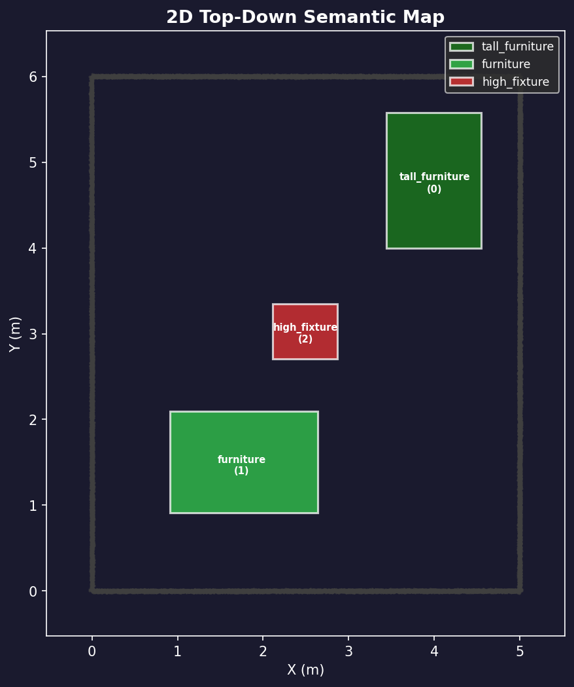
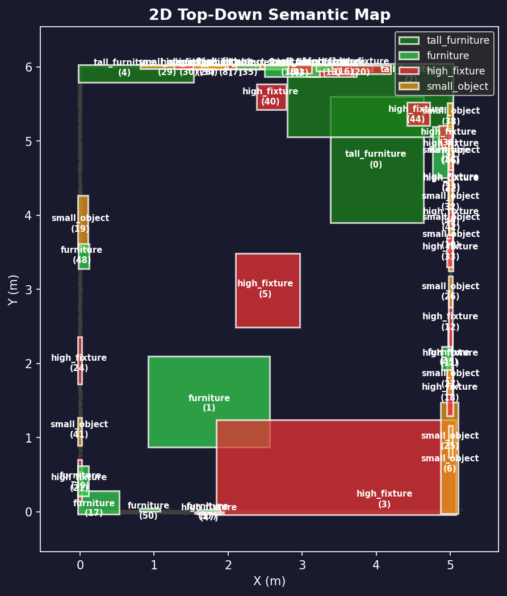

# 3D Room Scene Semantic Segmentation Assignment- Divyansh Rawat

[](https://www.python.org/downloads/)
[](http://www.open3d.org/)
[](https://en.wikipedia.org/wiki/Rule-based_system)

A production-grade, **geometry-only** pipeline for 3D indoor scene semantic segmentation. This project segments raw point clouds into structural elements (floor, walls, ceiling) and furniture objects using unsupervised clustering and rule-based heuristics — **zero deep learning required.**

---

## Documentation

For a deep-dive into the project's logic and architecture, please refer to the following:

- [**Technical Pipeline Guide (PIPELINE.md)**](PIPELINE.md): Installation, usage, and geometric heuristics.
- [**Implementation Roadmap (implementation.md)**](implementation.md): Full architectural breakdown and research references.

---

## 📸 Visual Results

|                   Final Semantic Segmentation                   |                 2D Top-Down Projection                 |
| :-------------------------------------------------------------: | :-----------------------------------------------------: |
|          |        |
| *Color-coded: Floor (Brown), Walls (Blue), Furniture (Green)* | *Occupancy grid with identified furniture footprints* |

---

## 🔥 Key Features

- **Structural Segmentation**: Iterative RANSAC with normal-alignment checks for floor, ceiling, and walls.
- **Object Clustering**: DBSCAN-based clustering for furniture and clutter.
- **Semantic Heuristics**: Automatic labeling based on Z-distribution, surface normals, and aspect-ratio analysis.
- **Bounding Boxes**: Axis-Aligned (AABB) and Oriented (OBB) bounding box estimation with dimensions.
- **Interactive Viewer**: Custom GUI for real-time manual inspection and labeling.
- **2D Mapping**: Automated generation of top-down occupancy and semantic maps.
- **Robust Testing**: 143+ unit and integration tests covering the entire pipeline.

---

## 🏗️ Architecture Overview

The pipeline follows a two-stage expert system approach to ensure clean separation between structural surfaces and furniture:

1. **Stage A (Structural)**: Uses **RANSAC** to "peel" away high-density planar primitives (floor, walls, ceiling).
2. **Stage B (Object)**: Performs **DBSCAN** Euclidean clustering on the non-planar residuals to isolate individual furniture units.
3. **Stage C (Refinement)**: Computes geometric properties (centroids, dimensions, orientation) for the final semantic report.

---

## 🛠️ Installation & Setup

```bash
# Clone the repository
git clone https://github.com/ERICR-recruiter/l02-DsThakurRawat.git
cd l02-DsThakurRawat

# Setup environment
python3 -m venv venv
source venv/bin/activate

# Install dependencies
pip install -r requirements.txt
```

---

## 🚀 Quickstart

### 1. Generate Synthetic Data

Perfect for immediate testing:

```bash
python3 scripts/generate_synthetic_room.py --output data/synthetic/room_01.ply
```

### 2. Run the Full Pipeline

```bash
python3 main.py --input data/synthetic/room_01.ply --config configs/default.yaml
```

### 3. Open Interactive Viewer

```bash
python3 -m src.interactive_viewer --input outputs/segmented_room.ply
```

---

## 📊 Technical Results & Outputs

Every run produces a standard artifacts bundle in the `outputs/` directory:

- **`segmented_room.ply`**: Fully labeled 3D point cloud.
- **`segmentation_report.json`**: Pydantic-validated JSON containing IDs, dimensions, and labels for all clusters.
- **`segmentation_viz.png`**: High-resolution 2D semantic map.

---

## 🧪 Testing

The project maintains a rigorous test suite with **143 tests** covering all geometric heuristics.

```bash
python3 -m pytest tests/ -v
```

---

## 📞 Contact Info

- **Name**: Divyansh Rawat
- **Contact number(s)**: +91 6261283255 / +91 8239603324
- **Email address(es)**: [divyanshrawatofficial@gmail.com](mailto:divyanshrawatofficial@gmail.com), [divyanshthakur594@gmail.com](mailto:divyanshthakur594@gmail.com)
- **GitHub Username**: DsThakurRawat

---

*Good luck! This assignment will test your ability to reason about geometry and clustering in 3D scenes.*
