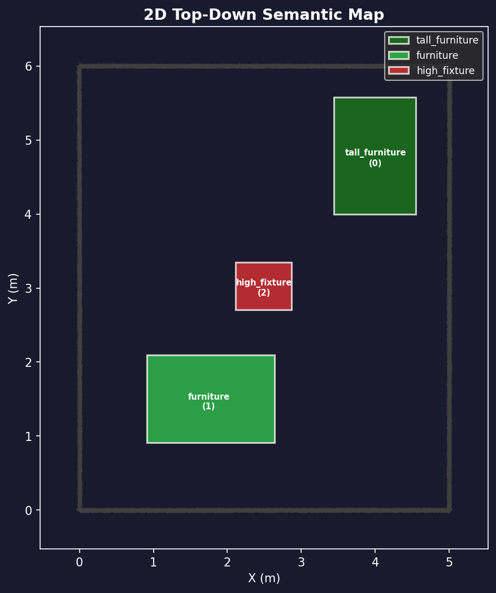
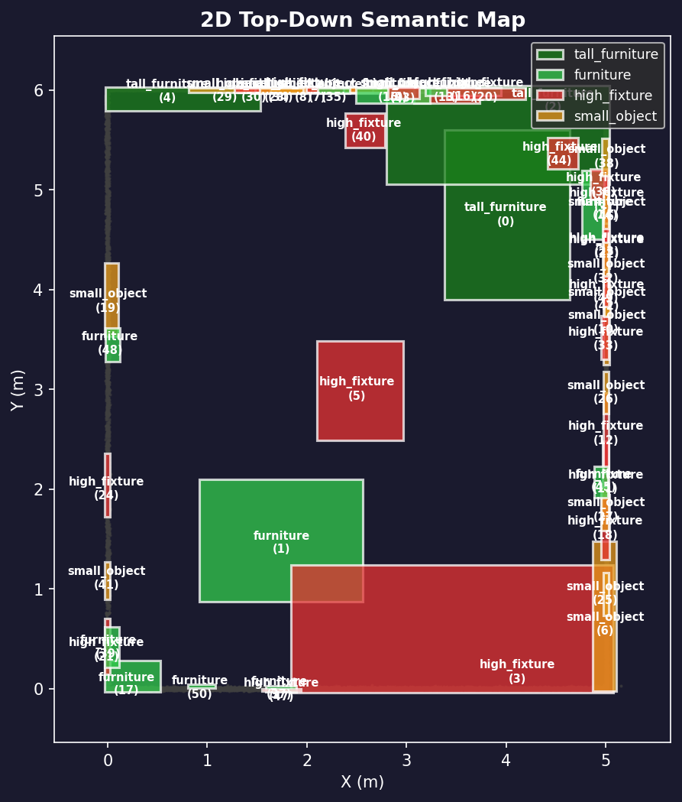

# Geometric Scene Architect

[](https://www.python.org/downloads/)
[](http://www.open3d.org/)
[](https://en.wikipedia.org/wiki/Rule-based_system)

A geometry-first pipeline for 3D indoor scene semantic segmentation. It segments raw point clouds into structure (floor, walls, ceiling) and furniture using RANSAC planes, DBSCAN clustering, and geometric heuristics -- no deep learning required for the structural majority of a scene.

**Thesis:** geometry labels the structural majority of a scan for free; learning only earns its keep on objects. We test this on **S3DIS Area-5** across four arms (geometry-only, feature-ML, hybrid, PointNet++) through one shared evaluator.

| Final Semantic Segmentation | 2D Top-Down Projection |
| :---: | :---: |
|  |  |
| *Floor (Brown), Walls (Blue), Furniture (Green)* | *Occupancy grid with furniture footprints* |

## How It Works

A two-stage expert system that cleanly separates surfaces from objects:

1. **Structure** - iterative RANSAC with normal-alignment checks peels away planar primitives (floor, ceiling, walls).
2. **Objects** - DBSCAN clusters the non-planar residual into individual furniture units.
3. **Refinement** - per-cluster geometry (centroid, dimensions, orientation, AABB/OBB) feeds the semantic report.

## Install

```bash
git clone https://github.com/DsThakurRawat/Geometric-Scene-Architect.git
cd Geometric-Scene-Architect
python3 -m venv venv && source venv/bin/activate
pip install -r requirements.txt
```

## Quickstart

```bash
# 1. Generate a synthetic room to test against
python3 scripts/generate_synthetic_room.py --output data/synthetic/room_01.ply

# 2. Run the full pipeline
python3 main.py --input data/synthetic/room_01.ply --config configs/default.yaml

# 3. Inspect results in the interactive viewer
python3 -m src.interactive_viewer --input outputs/segmented_room.ply
```

Each run writes to `outputs/`: `segmented_room.ply` (labeled cloud), `segmentation_report.json` (validated cluster report), and `segmentation_viz.png` (2D semantic map).

## Results

Evaluated on S3DIS Area-5 (global mIoU). Structure comes out near-identical across all arms - geometry gets it for free - while objects are where learning pays off.

| Arm | mIoU | OA |
|---|---|---|
| geometry_only | 0.1974 | 0.6257 |
| feature_ml | 0.2987 | 0.6636 |
| hybrid | 0.2749 | 0.6582 |
| hybrid_v2 | 0.2986 | 0.6636 |

Full per-class IoU, the RGB ablation, and the label-efficiency study are in **[docs/EXPERIMENTS.md](docs/EXPERIMENTS.md)**.

## Docs

- **[PIPELINE.md](PIPELINE.md)** - installation, usage, and geometric heuristics in depth.
- **[implementation.md](implementation.md)** - architecture and research references.
- **[docs/EXPERIMENTS.md](docs/EXPERIMENTS.md)** - S3DIS benchmarks and ablations.
- **[docs/failure_cases.md](docs/failure_cases.md)** - S3DIS Area-5 failure cases and qualitative analysis.

## Testing

```bash
python3 -m pytest tests/ -v
```

## Author

**Divyansh Rawat** | divyanshthakur594@gmail.com | [DsThakurRawat](https://github.com/DsThakurRawat)
